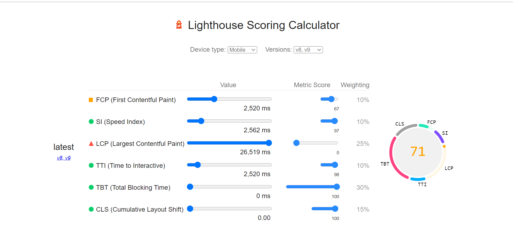

# Yoga Shala

Welcome! [Yoga Shala](https://shankar2311.github.io/P1-yoga/)

Yoga Shala is a Virtual Yoga Program which mainly focuses on Live and Online classes. The main idea of this site is to motivate people of different ages and make yoga an important part of our life. Yoga Shala will be useful for people who are interested in learning body and mind self-improvement techniques.This website will be targeted toward people who are willing to stay fit and want to achieve peace and balance in their life.

## Features

### Existing Features

- ***Logo and Navigation Bar***

    - Featured on all three pages, the full responsive navigation bar includes links to the Logo, Home page, Techniques and Sign Up page and is identical in each page to allow for easy navigation.

    - This section will allow the user to easily navigate from page to page across all devices without having to revert back to the previous page via the ‘back’ button.

- ***The Home Page Image***

    - The Home Page includes a photograph with text overlay to allow the user to see exactly for what this site would be applicable to.

    - This section introduces the user to Yoga Shala with an eye catching animation to grab their attention.

- ***About Section***

    - The About section will allow the user to know more about the Yoga.

    - This user will see the benefits of doing Yoga. This should encourage the user to consider Yoga as their daily routine.

    - Shows our main goal and our commitment in helping and teaching the required techinques to users.

- ***The Footer***

    - The footer section includes links to the relevant social media sites for Yoga Shala website. The links will open to a new tab to allow easy navigation for the user.

    - The footer is valuable to the user as it encourages them to keep connected via social media.

 

- ***Techniques Page***

    - The techniques page will provide the user with supporting images and relevant information regarding different types of Yoga.

    - This section is valuable to the user as they will be able to easily identify the types of Yoga and can choose the preferable one according to the user.

    - The landing image in this page catches the user attention in knowing about the different types of Yoga.

- ***The Sign Up Page***

    - This page will allow the user to get signed up to Yoga Shala. The user will be asked to submit their full name and email address.

## Testing

    - The site works well on different browsers like Chrome, Firefox and Microsoft Edge.

    - Shown good results while testing responsiveness to different screens size.

    

- ***Validator Testing***
    - HTML
        - No errors were found when passing through the official [W3C validator](https://validator.w3.org/nu/?doc=https%3A%2F%2Fshankar2311.github.io%2FP1-yoga%2F)

    - CSS
        - No errors were found when passing through the official [(Jigsaw)validator](https://jigsaw.w3.org/css-validator/validator?uri=https%3A%2F%2Fshankar2311.github.io%2FP1-yoga%2F&profile=css3svg&usermedium=all&warning=1&vextwarning=&lang=en)

- ***Lighthouse Report***

    - Accessibility

 

- ***Unfixed Bugs***

    - The value of Performance shown on mobile device is 72 and on desktop is 60.

## Deployment

    - The process to deploy the project to Github Pages are as follows:

1. Log in to GitHub.com

2. Select the GitHub repository and navigate to the settings.

3. Find the Pages tab and click on it.

4. From the source drop-down menu, select the "Deploy from a branch".

5. And from the Branch menu, select the "main".

6. Click the "save" button, the page will be automatically refreshed.

7. A live link will be dispalyed on top of the page.

## Credits

- ***Content***

    - The text from the Home page was taken from wikipedia [here](https://en.wikipedia.org/wiki/Yoga).

    - For the Techniques page, some of the text was taken from healthifyme [here](https://www.healthifyme.com/blog/types-of-yoga/)  

    - Layout and structure of the sign up page was influenced from love running project by Code Institute. 

    - README.md file was taken from the Code Institute readme-template.

    - The Fonts were taken from [Google Fonts](https://fonts.google.com/) and [fontjoy](https://fontjoy.com/)

- ***Code***

    - The Code for Home page was influenced from Coders coffeehouse by Code Institute and made required changes for my site.

    - The code for Techniques page and Sign up was influenced from Love Running Project by Code Institute.

- ***Media***

    - Images are taken from [pexels](https://www.pexels.com/)

      - The icons in the footer were taken from [Font Awesome](https://fontawesome.com/)

## Acknowledgement

    - I would like to thank the people in peer-code-review on Slack who reviewed and suggested changes in my code.

    - Very Thankfull to Code Institute Slack Community.

